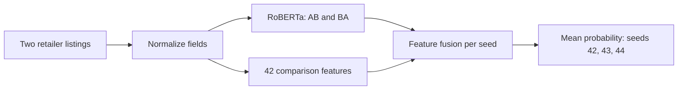

# Product Entity Matching

**English** | [简体中文](README.zh-CN.md)

**[Project site](https://yemyu.github.io/product-entity-matching/showcase/en/index.html) · [Notebook](notebooks/product-matching-walkthrough.ipynb) · [Reproduction guide](docs/REPRODUCIBILITY.md)**

Two retailers can describe the same product with different titles, model-number spellings and missing fields. This project compares two listings and predicts whether they refer to the same product. It covers field handling, model training, comparative evaluation and input reconstruction.

## 🧩 Models and controls

The comparison starts with models using only numerical features, then adds text encoders. Logistic regression combines comparison features into a match score; gradient-boosted trees can learn nonlinear feature combinations. RoBERTa and MiniLM encode product text as vectors. This project fine-tunes RoBERTa and uses MiniLM without updating its weights.

The identifiers below are experiment names used in this project. C+ is the final RoBERTa-and-feature model; C0 is its separately trained counterpart with zeroed comparison features. The numbers in B22, L30, S33 and L42 indicate the input feature counts.

| ID | Method and inputs | Purpose |
| --- | --- | --- |
| B22 | Logistic regression with 22 comparison features | Basic tabular reference |
| L30 | Histogram gradient-boosted trees with 30 comparison features | Tabular reference with expanded features |
| S33 | L30 plus 3 fixed MiniLM semantic/missing-value features, still using gradient-boosted trees | Check the additional information from text vectors |
| L42 | Histogram gradient-boosted trees with all 42 comparison features | Strongest tabular reference |
| **C+** | **RoBERTa text representations fused with 42 comparison features** | **Final adopted method** |
| C0 | Independently trained RoBERTa control with the same architecture as C+; all 42 feature values are zeroed during training and prediction | Check the contribution of the additional comparisons |

**C+ inputs and output.** The text branch reads brand, model number, category and title. Comparison features add differences between titles, descriptions, brands, prices and native fields. Each pair is read in AB and BA order, where A and B denote the two retailer records. Training seeds control random initialization and data order; the final score averages match probabilities equally across seeds 42, 43 and 44. See the [model card](docs/MODEL_CARD.md) for the architecture and training settings.



## 📏 Evaluation metrics

The evaluation covers both pair ranking and match decisions at a fixed cutoff. All three metrics range from **0 to 1**, with higher values indicating better performance, but they measure different aspects.

| Metric | What it measures | How to read it |
| --- | --- | --- |
| **AP**: Average Precision | Overall ranking quality, combining precision and recall along the ranking | AP generally rises when true matches appear earlier; it does not require one classification cutoff |
| **F1** | The harmonic mean of precision and recall at a fixed cutoff | Accounts for both false matches and missed true matches; it depends on the cutoff |
| **P@100**: Precision at 100 | The fraction of true matches among the 100 highest-scoring pairs | For example, 0.90 means 90 of those 100 pairs truly match; it covers only those pairs |

Precision is the fraction of predicted matches that truly match. Recall is the fraction of all true matches that the model finds. F1 uses each method's cutoff selected on calibration data, without selecting it again during evaluation. AP sums precision weighted by each increase in recall; tied scores enter as one group, without interpolation. **AP is not classification accuracy**. P@100 of 1.00 does not mean that all pairs were classified correctly. [Metric implementation](src/product_matching/metrics.py)

## 📊 Results on the same pair pool

On **555 fixed Walmart–Amazon pairs**, the three-seed C+ ensemble achieved **AP 0.9660, F1 0.9016 and P@100 1.00**. Compared with L42, the best tabular reference, AP was **1.63 percentage points higher** and F1 was **4.96 percentage points higher**.

| Method | AP ↑ | F1 ↑ | P@100 ↑ |
| --- | ---: | ---: | ---: |
| B22 | 0.795590 | 0.743719 | 0.81 |
| L30 | 0.844899 | 0.762115 | 0.90 |
| S33 | 0.846702 | 0.767123 | 0.89 |
| L42 | 0.949700 | 0.852041 | 1.00 |
| **C+ (final method)** | **0.965998** | **0.901639** | **1.00** |
| C0 | 0.965616 | 0.875648 | 1.00 |

> **Evaluation scope:** All six methods use the same 555 pairs, including 190 true matches. These are retrospective results. The pool's history of use is not fully documented, and performance on an independent new Walmart–Amazon sample has not been tested.

**Feature control.** C0 has similar AP to C+, so this comparison does not establish a substantial AP gain from the 42 features. [Results and interpretation](showcase/en/results.html) · [Limitations](docs/LIMITATIONS.md)

## Project resources

- [Project site](https://yemyu.github.io/product-entity-matching/showcase/en/index.html): the task, data handling, method and results. A [local copy](showcase/en/index.html) is included.
- [Reproduction guide](docs/REPRODUCIBILITY.md): public checks, existing-weight replay and requirements for local model commands.

For more detail, see the [project brief](docs/PROJECT_CARD.md), [data card](docs/DATA_CARD.md), [model card](docs/MODEL_CARD.md), [CLI guide](docs/CORE_USAGE.md) and [code map](docs/CODE_MAP.md). The [aggregate result file](results/fixed-results.json) and [final configuration](reproducibility/FINAL_MODEL.json) supply the reported numbers and model settings.

## Data and model decisions

- **Keep uncertain fields explicit.** Missing prices stay missing. Prices are compared only when both values parse and their known currencies agree. Model-number letters and digits are compared separately to expose differences hidden by similar titles.
- **Fit title evidence once.** IDF (inverse document frequency) gives rarer title terms more weight. Title IDF is estimated from deduplicated fit records, then reused for development, calibration and evaluation. IDs and labels are excluded from the 42-feature vector. The [feature dictionary](docs/DATA_CARD.md#feature-dictionary) explains its four groups.
- **Handle both listing orders.** RoBERTa reads AB and BA with fixed field budgets and a maximum pair length of 256 tokens. Their logits are averaged before sigmoid; the resulting probabilities are averaged equally across seeds 42, 43 and 44.
- **Separate selection and scoring.** Fit has 3,738 pairs; development has 199; calibration has 209; evaluation has 555. Development selected common epoch 4, and calibration selected the evaluation cutoff. These interface rules do not resolve the pool's incomplete historical exposure record.

## Quickstart

You need Git and **Python 3.11 or newer**. Public checks and the website preview use only the standard library; no PyTorch installation, model download or product dataset is required.

```bash
git clone https://github.com/Yemyu/product-entity-matching.git
cd product-entity-matching
```

If you downloaded the repository ZIP, extract it and open the repository root before creating the environment. The project environment and its dependencies belong in `.venv`; keep source and data in their respective repository directories.

**macOS / Linux**

```bash
python3 -m venv .venv
source .venv/bin/activate
python scripts/public_smoke.py
python scripts/run_notebook.py
python scripts/run_tests.py
python scripts/verify_public_release.py
```

**Windows · PowerShell**

```powershell
py -3 -m venv .venv
.\.venv\Scripts\python.exe scripts/public_smoke.py
.\.venv\Scripts\python.exe scripts/run_notebook.py
.\.venv\Scripts\python.exe scripts/run_tests.py
.\.venv\Scripts\python.exe scripts/verify_public_release.py
```

The smoke check exercises entry points; the Notebook check runs both walkthroughs and compares saved outputs; tests cover field handling, features and metrics; release verification checks the file inventory, links and result arithmetic. JSON reports should show `status: passed`, and the test report should end with `OK`. These checks run neither model training nor inference on real product records.

**Local preview.** In the activated macOS/Linux environment, run:

```bash
python -m http.server 8000 --bind 127.0.0.1
```

On Windows, use `.\.venv\Scripts\python.exe -m http.server 8000 --bind 127.0.0.1`. Open the [English project site](http://127.0.0.1:8000/showcase/en/index.html); the navigation also offers Chinese. Keep the terminal running, and press `Ctrl+C` to stop the server.

**Model commands.** Real input preparation and prediction also need local product data, a RoBERTa snapshot and trained checkpoints. The [reproduction guide](docs/REPRODUCIBILITY.md) lists pinned CUDA dependencies and the checked Windows RTX 3060 configuration. The [CLI guide](docs/CORE_USAGE.md) gives file formats and step-by-step commands. Complete the lightweight checks first, then use that guide to create a separate GPU project environment; the quickstart above installs no neural dependencies.

## Reconstruct the experiment inputs

Obtain the original [Walmart–Amazon ZIP](https://pages.cs.wisc.edu/~anhai/data1/deepmatcher_data/Structured/Walmart-Amazon/walmart_amazon_exp_data.zip) and place it at `inputs/walmart_amazon_exp_data.zip`. From the repository root, choose an output directory that does not yet exist:

```bash
python scripts/matching.py reconstruct-roles \
  --source-archive inputs/walmart_amazon_exp_data.zip \
  --recipe reproducibility/ROLE_RECONSTRUCTION.json \
  --output ../product-matching-inputs
```

The command verifies the ZIP identity and restores the original **3,738 fit, 199 development, 209 calibration and 555 evaluation pairs**. All four business-input files have been checked byte for byte against the frozen inputs. Evaluation, development and calibration labels are written separately under `private/`; only the fit input includes labels. The bundled recipe contains source positions and processing metadata, without product values or labels. [File layout and model commands](docs/CORE_USAGE.md)

Existing-weight replay also ran on a Windows 11 RTX 3060 laptop: **20 commands produced 23 result groups, with zero differences from the frozen outputs**. This verified preparation and prediction through the public entry. Fresh end-to-end retraining and independent new Walmart–Amazon sample performance have not been validated. Data, model snapshots and trained weights must be supplied locally and are not included in the repository.

## Repository

```text
src/product_matching/   field handling, features, models, metrics and CLI
results/                saved aggregate results
reproducibility/        fixed configuration, feature order and file inventory
docs/                   English guides; matching Chinese guides in zh-CN/
notebooks/              English and Chinese executable walkthroughs
showcase/               English and Chinese static project pages
scripts/ and tests/     command entry points and public checks
```

## License

The matching package is licensed under [MIT](LICENSE). The project pages derive from the Academic Project Page Template and use [CC BY-SA 4.0](showcase/LICENSE); [NOTICE](showcase/NOTICE.md) identifies the source and modifications. Third-party data and pretrained models retain their own terms.
