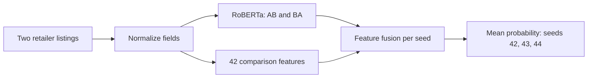

# Product Entity Matching

**🌐 English** | [🇨🇳 简体中文](README.zh-CN.md)

**[Project site](https://yemyu.github.io/product-entity-matching/showcase/en/index.html) · [Notebook](notebooks/product-matching-walkthrough.ipynb) · [Reproduction guide](docs/REPRODUCIBILITY.md)**

Two retailers can describe the same product with different titles, model-number spellings and missing fields. This project compares two listings and predicts whether they refer to the same product. It includes field handling, comparison features, model training and evaluation.

## 🧩 Models and inputs

The comparison starts with numerical features, then adds text encoders. Logistic regression combines comparison features into a score; gradient-boosted trees learn nonlinear combinations. RoBERTa and MiniLM encode text as vectors. This project fine-tunes RoBERTa and uses MiniLM with fixed weights.

The identifiers below are experiment names used in this project. C+ is the final RoBERTa-and-feature model; C0 is its separately trained counterpart with zeroed comparison features. The numbers in B22, L30, S33 and L42 indicate the input feature counts.

| ID | Method and inputs | Purpose |
| --- | --- | --- |
| B22 | Logistic regression with 22 comparison features | Basic tabular reference |
| L30 | Histogram gradient-boosted trees with 30 comparison features | Tabular reference with expanded features |
| S33 | L30 plus 3 fixed MiniLM semantic/missing-value features, still using gradient-boosted trees | Check the additional information from text vectors |
| L42 | Histogram gradient-boosted trees with all 42 comparison features | Strongest tabular reference |
| **C+** | **RoBERTa text representations fused with 42 comparison features** | **Final adopted method** |
| C0 | Independently trained RoBERTa control with the same architecture as C+; all 42 feature values are zeroed during training and prediction | Check the contribution of the additional comparisons |

**C+ inputs and output.** The text branch reads brand, model number, category and title. Comparison features add differences between titles, descriptions, brands, prices and native fields. Each pair is read in AB and BA order, where A and B denote the two retailer records. Their raw scores (logits) are averaged, then mapped to a probability by sigmoid. Training seeds control random initialization and data order; the final score averages match probabilities equally across seeds 42, 43 and 44. See the [model card](docs/MODEL_CARD.md) for the architecture and training settings.



**Field handling.** Missing values remain missing; prices are compared only when both parse and their known currencies agree. Title IDF (inverse document frequency) gives rarer terms more weight. It is fitted on deduplicated fit records and reused for development, calibration and evaluation.

## 📏 Evaluation metrics

All three metrics range from 0 to 1, with higher values indicating better performance.

| Metric | What it measures |
| --- | --- |
| **AP**: Average Precision | Ranking quality across precision and recall; it does not require one classification cutoff |
| **F1** | Harmonic mean of precision and recall at the cutoff selected on calibration data |
| **P@100**: Precision at 100 | Fraction of true matches among the 100 highest-scoring pairs |

Precision is the fraction of predicted matches that truly match; recall is the fraction of all true matches found. P@100 of 0.90 means that 90 of the first 100 pairs truly match.

## 📊 Results on the same pair pool

On **555 fixed Walmart–Amazon pairs**, the three-seed C+ ensemble achieved **AP 0.9660, F1 0.9016 and P@100 1.00**. Compared with L42, the best tabular reference, AP was **1.63 percentage points higher** and F1 was **4.96 percentage points higher**.

| Method | AP ↑ | F1 ↑ | P@100 ↑ |
| --- | ---: | ---: | ---: |
| B22 | 0.795590 | 0.743719 | 0.81 |
| L30 | 0.844899 | 0.762115 | 0.90 |
| S33 | 0.846702 | 0.767123 | 0.89 |
| L42 | 0.949700 | 0.852041 | 1.00 |
| **C+ (final method)** | **0.965998** | **0.901639** | **1.00** |
| C0 | 0.965616 | 0.875648 | 1.00 |

> **Evaluation scope:** All six methods use the same 555 pairs, including 190 true matches. AP is a ranking metric, not classification accuracy; P@100 describes only the first 100 pairs. These are retrospective results. The pool's history of use is not fully documented, and performance on an independent new Walmart–Amazon sample has not been tested.

**Feature control.** C0 has similar AP to C+, so this comparison does not establish a substantial AP gain from the 42 features. [Results and interpretation](showcase/en/results.html) · [Limitations](docs/LIMITATIONS.md)

## Quickstart

You need Git and **Python 3.11 or newer**. These checks and the website preview use only the standard library.

```bash
git clone https://github.com/Yemyu/product-entity-matching.git
cd product-entity-matching
```

If you downloaded the ZIP, extract it and open the repository root. Verify that your selected Python is 3.11+ before creating the lightweight `.venv` environment.

**macOS / Linux**

```bash
python3 --version
python3 -m venv .venv
.venv/bin/python scripts/public_smoke.py
.venv/bin/python scripts/run_notebook.py
```

**Windows · PowerShell**

```powershell
py -3.11 --version
py -3.11 -m venv .venv
.\.venv\Scripts\python.exe scripts/public_smoke.py
.\.venv\Scripts\python.exe scripts/run_notebook.py
```

Use another installed 3.11+ interpreter if needed. JSON reports should show `status: passed`. These steps check synthetic inputs and saved Notebook outputs; they do not run models on product data. Full tests and release-inventory checks are in the [reproduction guide](docs/REPRODUCIBILITY.md#lightweight-checks).

For a local preview, run `.venv/bin/python -m http.server 8000 --bind 127.0.0.1` on macOS/Linux, or `.\.venv\Scripts\python.exe -m http.server 8000 --bind 127.0.0.1` on Windows. Open the [English project site](http://127.0.0.1:8000/showcase/en/index.html). Keep the terminal running; press `Ctrl+C` to stop it.

## Further reproduction

The [reproduction guide](docs/REPRODUCIBILITY.md) explains the available files and the separate `.venv-gpu` environment for model commands. The [command guide](docs/CORE_USAGE.md) follows a continuous path from the original Walmart–Amazon ZIP through preparation, prediction, calibration and evaluation. All local product inputs and run outputs belong in `../product-matching-work/`, beside the checkout.

Source reconstruction matched the **3,738 fit, 199 development, 209 calibration and 555 evaluation inputs** byte for byte. Existing-weight replay on a Windows 11 RTX 3060 laptop produced **23 checked result groups from 20 commands, with zero differences from the retained outputs**. Fresh end-to-end retraining has not been validated. The original trained weights have **no public download entry**; exact replay requires already holding those weights. Product data and model snapshots must also be obtained separately.

For more detail, see the [project brief](docs/PROJECT_CARD.md), [data card](docs/DATA_CARD.md), [model card](docs/MODEL_CARD.md) and [code map](docs/CODE_MAP.md). Repository layout:

```text
src/product_matching/       fields, features, models, metrics and CLI
docs/                      bilingual guides
notebooks/                 bilingual executable walkthroughs
showcase/                  bilingual static project pages
reproducibility/           fixed configuration, source recipe and file identities
results/                   saved aggregate results
../product-matching-work/  local inputs and run outputs
```

## License

The matching package is licensed under [MIT](LICENSE). The project pages derive from the Academic Project Page Template and use [CC BY-SA 4.0](showcase/LICENSE); [NOTICE](showcase/NOTICE.md) identifies the source and modifications. Third-party data and pretrained models retain their own terms.
