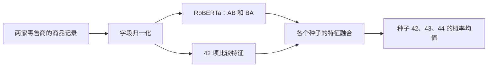

# 商品实体匹配

[English](README.md) | **简体中文**

**[项目展示](https://yemyu.github.io/product-entity-matching/showcase/zh-CN/index.html) · [Notebook](notebooks/product-matching-walkthrough.zh-CN.ipynb) · [复现指南](docs/zh-CN/REPRODUCIBILITY.md)**

同一商品在两家零售商处，可能有不同的标题、型号写法和缺失字段。本项目比较两条商品记录，判断它们是否指向同一商品，涵盖字段处理、模型训练、对照评价和输入复现。

## 🧩 模型与对照

比较从只使用数值特征的模型开始，再加入文本编码器。逻辑回归将比较特征组合成匹配分数；梯度提升树可以学习特征之间的非线性组合。RoBERTa 和 MiniLM 将商品文本编码为向量，本项目微调前者，固定使用后者。

下表的标识是本项目的实验简称。C+ 指最终采用的 RoBERTa 与比较特征融合模型，C0 指比较特征置零后独立训练的同结构对照；B22、L30、S33、L42 中的数字表示输入特征数。

| 标识 | 方法与输入 | 比较目的 |
| --- | --- | --- |
| B22 | 逻辑回归，22 项比较特征 | 基础表格对照 |
| L30 | 直方图梯度提升树，30 项比较特征 | 扩展特征的表格对照 |
| S33 | 在 L30 上添加 3 项固定 MiniLM 语义/缺失特征，仍使用梯度提升树 | 检查文本向量提供的补充信息 |
| L42 | 直方图梯度提升树，全部 42 项比较特征 | 最强的表格对照 |
| **C+** | **RoBERTa 文本表示与 42 项比较特征融合** | **最终采用的方案** |
| C0 | 与 C+ 结构相同、独立训练的 RoBERTa 对照；保留 42 维输入，训练和推断时均置零 | 检查额外比较特征的作用 |

**C+ 的输入与输出。** 文本分支读取品牌、型号、类别和标题；比较特征补充标题、描述、品牌、价格与原生字段之间的差异。每对记录按 AB 和 BA 两个顺序读取，A、B 分别指两家零售商的记录。训练种子控制随机初始化和数据顺序，最终等权平均种子 42、43、44 三个模型的匹配概率。结构和训练设置见[模型卡](docs/zh-CN/MODEL_CARD.md)。



## 📏 评价指标

这里既评价商品对的排序，也评价固定阈值下的匹配判断。三个指标都在 **0 到 1** 之间，数值越高越好，但衡量的内容不同。

| 指标 | 衡量什么 | 如何理解 |
| --- | --- | --- |
| **AP**：平均精确率（Average Precision） | 整体排序质量，综合排序过程中的精确率与召回率 | 真实匹配越集中在排序前部，AP 通常越高；不需要先选一个分类阈值 |
| **F1** | 固定阈值下，精确率与召回率的调和平均 | 同时考虑把不同商品误判为匹配、以及漏掉真实匹配；数值会受阈值影响 |
| **P@100**：前 100 对的精确率 | 按分数排序后，前 100 对中真实匹配的比例 | 例如 0.90 表示前 100 对中有 90 对真实匹配；只评价这 100 对 |

精确率指“判为匹配的商品对中，有多少确实匹配”；召回率指“所有真实匹配中，有多少被找到了”。F1 使用各方法在校准数据上选定的阈值，评价时不重新选择。AP 按每次召回率的增量，对对应精确率加权求和；同分商品对作为一组，不做插值。**AP 不是分类准确率**；P@100 为 1.00 也不表示全部样本都判断正确。[指标实现](src/product_matching/metrics.py)

## 📊 同一批商品对上的结果

在 **555 对固定的 Walmart–Amazon 商品记录**上，三个种子的 C+ 集成结果为 **AP 0.9660、F1 0.9016、P@100 1.00**。相较表现最好的表格模型 L42，AP 提高 **1.63 个百分点**，F1 提高 **4.96 个百分点**。

| 方法 | AP ↑ | F1 ↑ | P@100 ↑ |
| --- | ---: | ---: | ---: |
| B22 | 0.795590 | 0.743719 | 0.81 |
| L30 | 0.844899 | 0.762115 | 0.90 |
| S33 | 0.846702 | 0.767123 | 0.89 |
| L42 | 0.949700 | 0.852041 | 1.00 |
| **C+（最终方案）** | **0.965998** | **0.901639** | **1.00** |
| C0 | 0.965616 | 0.875648 | 1.00 |

> **评价范围：** 六种方法使用同一批 555 对样本，其中 190 对真实匹配。这是回顾性比较，历史接触记录不完整；尚未测试 Walmart–Amazon 独立新样本的表现。

**特征对照。** C0 的 AP 与 C+ 接近，当前比较不能说明这 42 项特征带来了明显的 AP 增益。[结果与解读](showcase/zh-CN/results.html) · [局限](docs/zh-CN/LIMITATIONS.md)

## 项目入口

- [项目展示](showcase/zh-CN/index.html)：了解问题、数据处理、方法和结果。
- [复现指南](docs/zh-CN/REPRODUCIBILITY.md)：了解公开检查、现有权重回放及本地模型命令所需条件。

完整说明见[项目卡](docs/zh-CN/PROJECT_CARD.md)、[数据卡](docs/zh-CN/DATA_CARD.md)、[模型卡](docs/zh-CN/MODEL_CARD.md)、[命令指南](docs/zh-CN/CORE_USAGE.md)和[代码地图](docs/zh-CN/CODE_MAP.md)。报告的数值和模型设置分别来自[聚合结果文件](results/fixed-results.json)与[最终配置](reproducibility/FINAL_MODEL.json)。

## 数据与模型选择

- **保留字段的不确定性。** 缺失价格保持缺失。只有两条价格都能解析、币种已知且相同，才比较价格。型号的字母与数字另做比较，以免相似标题掩盖型号差异。
- **只用训练数据拟合标题证据。** IDF（逆文档频率）给较少见的标题词更高权重。标题 IDF 从去重后的训练记录估计，再用于开发、校准和评价数据。ID 和标签不进入 42 维特征向量。[特征字典](docs/zh-CN/DATA_CARD.md#特征字典)说明了四组比较。
- **处理两个记录顺序。** RoBERTa 按固定字段预算读取 AB 和 BA，每对最多 256 个 token。先平均两个方向的 logit，再取 sigmoid；最后等权平均种子 42、43、44 的概率。
- **分开选择与评分。** 训练、开发、校准和评价数据分别有 3,738、199、209、555 对。开发数据选择共同第 4 轮，校准数据选择评价阈值。这些接口规则不能补全评价池的历史接触记录。

## 快速开始

需要 Git 和 **Python 3.11 或更高版本**。公开检查与网页预览只用标准库，无需安装 PyTorch、下载模型或准备商品数据。

```bash
git clone https://github.com/Yemyu/product-entity-matching.git
cd product-entity-matching
```

若下载的是仓库 ZIP，解压后进入仓库根目录，从创建环境开始。环境和依赖放在项目的 `.venv` 中，源码与数据保留在仓库对应目录。

**macOS / Linux**

```bash
python3 -m venv .venv
source .venv/bin/activate
python scripts/public_smoke.py
python scripts/run_notebook.py
python scripts/run_tests.py
python scripts/verify_public_release.py
```

**Windows · PowerShell**

```powershell
py -3 -m venv .venv
.\.venv\Scripts\python.exe scripts/public_smoke.py
.\.venv\Scripts\python.exe scripts/run_notebook.py
.\.venv\Scripts\python.exe scripts/run_tests.py
.\.venv\Scripts\python.exe scripts/verify_public_release.py
```

冒烟检查检查程序入口；Notebook 检查执行两份讲解并比对保存输出；测试覆盖字段处理、特征和指标；发布校验检查文件清单、链接及结果算术。JSON 报告的 `status` 应为 `passed`，测试报告应以 `OK` 结束。这些检查不会进行模型训练或真实商品推断。

**本地预览。** 在已激活的 macOS/Linux 环境运行：

```bash
python -m http.server 8000 --bind 127.0.0.1
```

Windows 使用 `.\.venv\Scripts\python.exe -m http.server 8000 --bind 127.0.0.1`。打开[中文项目页](http://127.0.0.1:8000/showcase/zh-CN/index.html)，导航栏可切换英文。保持终端运行，按 `Ctrl+C` 停止服务器。

**运行模型。** 真实输入准备与预测还需要本地商品数据、RoBERTa 快照和训练检查点。固定 CUDA 依赖及已核对的 Windows RTX 3060 配置见[复现指南](docs/zh-CN/REPRODUCIBILITY.md)，文件格式和逐步命令见[命令指南](docs/zh-CN/CORE_USAGE.md)。先完成轻量检查，再按该指南建立独立 GPU 项目环境；上方快速开始不安装神经网络依赖。

## 恢复原实验输入

自行取得原始 [Walmart–Amazon ZIP](https://pages.cs.wisc.edu/~anhai/data1/deepmatcher_data/Structured/Walmart-Amazon/walmart_amazon_exp_data.zip)，放到 `inputs/walmart_amazon_exp_data.zip`。在仓库根目录运行，输出目录须尚未存在：

```bash
python scripts/matching.py reconstruct-roles \
  --source-archive inputs/walmart_amazon_exp_data.zip \
  --recipe reproducibility/ROLE_RECONSTRUCTION.json \
  --output ../product-matching-inputs
```

程序先核对 ZIP 身份，再恢复原实验的 **3,738 对训练、199 对开发、209 对校准和 555 对评价输入**。四份业务文件已与冻结输入逐字节核对一致。开发、校准和评价标签另存到 `private/`，只有训练输入包含标签。仓库中的配方只保存源记录位置和处理信息，不包含商品值或标签。[输出目录与模型命令](docs/zh-CN/CORE_USAGE.md)

现有权重回放也已在 Windows 11 的 RTX 3060 笔记本上完成：**20 条命令产生 23 组结果，与原产物的差值为 0**。它验证了公开入口的准备和预测流程。从头重新训练整套实验和 Walmart–Amazon 独立新样本的表现仍未验收。商品数据、模型快照和训练权重需在本地提供，未包含在仓库中。

## 仓库目录

```text
src/product_matching/   字段处理、特征、模型、指标与 CLI
results/                保存的聚合结果
reproducibility/        固定配置、特征顺序与文件清单
docs/                   英文指南；对应中文指南在 zh-CN/ 中
notebooks/              英文和中文的可执行讲解
showcase/               英文和中文的静态项目页
scripts/ 与 tests/      命令入口与公开检查
```

## 许可

匹配程序使用 [MIT 许可](LICENSE)。项目网页基于 Academic Project Page Template 改写，使用 [CC BY-SA 4.0](showcase/LICENSE)；[NOTICE](showcase/NOTICE.md)记录来源与修改。第三方数据和预训练模型仍按各自条款使用。
