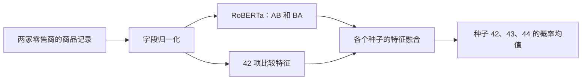

# 商品实体匹配

[🌐 English](README.md) | **🇨🇳 简体中文**

**[项目展示](https://yemyu.github.io/product-entity-matching/showcase/zh-CN/index.html) · [Notebook](notebooks/product-matching-walkthrough.zh-CN.ipynb) · [复现指南](docs/zh-CN/REPRODUCIBILITY.md)**

同一商品在两家零售商处，可能有不同的标题、型号写法和缺失字段。本项目比较两条商品记录，判断它们是否指向同一商品，包含字段处理、比较特征、模型训练和评价。

## 🧩 模型与输入

比较从数值特征开始，再加入文本编码器。逻辑回归将比较特征组合成匹配分数；梯度提升树学习特征之间的非线性组合。RoBERTa 和 MiniLM 将文本编码为向量，本项目微调前者，固定使用后者。

下表的标识是本项目的实验简称。C+ 指最终采用的 RoBERTa 与比较特征融合模型，C0 指比较特征置零后独立训练的同结构对照；B22、L30、S33、L42 中的数字表示输入特征数。

| 标识 | 方法与输入 | 比较目的 |
| --- | --- | --- |
| B22 | 逻辑回归，22 项比较特征 | 基础表格对照 |
| L30 | 直方图梯度提升树，30 项比较特征 | 扩展特征的表格对照 |
| S33 | 在 L30 上添加 3 项固定 MiniLM 语义/缺失特征，仍使用梯度提升树 | 检查文本向量提供的补充信息 |
| L42 | 直方图梯度提升树，全部 42 项比较特征 | 最强的表格对照 |
| **C+** | **RoBERTa 文本表示与 42 项比较特征融合** | **最终采用的方案** |
| C0 | 与 C+ 结构相同、独立训练的 RoBERTa 对照；保留 42 维输入，训练和推断时均置零 | 检查额外比较特征的作用 |

**C+ 的输入与输出。** 文本分支读取品牌、型号、类别和标题；比较特征补充标题、描述、品牌、价格与原生字段之间的差异。每对记录按 AB 和 BA 两个顺序读取，A、B 分别指两家零售商的记录。先平均两个方向的原始分数（logit），通过 sigmoid 转为概率。训练种子控制随机初始化和数据顺序；最终等权平均种子 42、43、44 的匹配概率。结构和训练设置见[模型卡](docs/zh-CN/MODEL_CARD.md)。



**字段处理。** 缺失值保持缺失；只有两条价格均能解析、已知币种相同，才比较价格。标题 IDF（逆文档频率）给较少见的词更高权重，从去重后的训练记录拟合，再用于开发、校准和评价。

## 📏 评价指标

三个指标都在 0 到 1 之间，数值越高越好。

| 指标 | 衡量什么 |
| --- | --- |
| **AP**：平均精确率（Average Precision） | 综合精确率与召回率的排序质量；不需要先选一个分类阈值 |
| **F1** | 校准数据选定阈值下，精确率与召回率的调和平均 |
| **P@100**：前 100 对的精确率 | 按分数排序后，前 100 对中真实匹配的比例 |

精确率指判为匹配的商品对中有多少确实匹配；召回率指所有真实匹配中有多少被找到。P@100 为 0.90 表示最前的 100 对中有 90 对真实匹配。

## 📊 同一批商品对上的结果

在 **555 对固定的 Walmart–Amazon 商品记录**上，三个种子的 C+ 集成结果为 **AP 0.9660、F1 0.9016、P@100 1.00**。相较表现最好的表格模型 L42，AP 提高 **1.63 个百分点**，F1 提高 **4.96 个百分点**。

| 方法 | AP ↑ | F1 ↑ | P@100 ↑ |
| --- | ---: | ---: | ---: |
| B22 | 0.795590 | 0.743719 | 0.81 |
| L30 | 0.844899 | 0.762115 | 0.90 |
| S33 | 0.846702 | 0.767123 | 0.89 |
| L42 | 0.949700 | 0.852041 | 1.00 |
| **C+（最终方案）** | **0.965998** | **0.901639** | **1.00** |
| C0 | 0.965616 | 0.875648 | 1.00 |

> **评价范围：** 六种方法使用同一批 555 对样本，其中 190 对真实匹配。AP 衡量排序质量，不是分类准确率；P@100 只描述最前的 100 对。这是回顾性比较，历史接触记录不完整；尚未测试 Walmart–Amazon 独立新样本的表现。

**特征对照。** C0 的 AP 与 C+ 接近，当前比较不能说明这 42 项特征带来了明显的 AP 增益。[结果与解读](showcase/zh-CN/results.html) · [局限](docs/zh-CN/LIMITATIONS.md)

## 快速开始

需要 Git 和 **Python 3.11 或更高版本**。这些检查与网页预览只用标准库。

```bash
git clone https://github.com/Yemyu/product-entity-matching.git
cd product-entity-matching
```

若下载的是 ZIP，解压后进入仓库根目录。先确认选用的 Python 为 3.11+，再创建轻量 `.venv` 环境。

**macOS / Linux**

```bash
python3 --version
python3 -m venv .venv
.venv/bin/python scripts/public_smoke.py
.venv/bin/python scripts/run_notebook.py
```

**Windows · PowerShell**

```powershell
py -3.11 --version
py -3.11 -m venv .venv
.\.venv\Scripts\python.exe scripts/public_smoke.py
.\.venv\Scripts\python.exe scripts/run_notebook.py
```

可按需要选择另一个已安装的 3.11+ 解释器。JSON 报告的 `status` 应为 `passed`。这些步骤检查合成输入与 Notebook 保存输出，不在商品数据上运行模型；完整测试与发布清单校验见[复现指南](docs/zh-CN/REPRODUCIBILITY.md#轻量检查)。

本地预览在 macOS/Linux 使用 `.venv/bin/python -m http.server 8000 --bind 127.0.0.1`，Windows 使用 `.\.venv\Scripts\python.exe -m http.server 8000 --bind 127.0.0.1`。打开[中文项目页](http://127.0.0.1:8000/showcase/zh-CN/index.html)，保持终端运行，按 `Ctrl+C` 停止服务。

## 进一步复现

[复现指南](docs/zh-CN/REPRODUCIBILITY.md)说明文件获取条件，以及模型命令使用的独立 `.venv-gpu` 环境。[命令指南](docs/zh-CN/CORE_USAGE.md)从原始 Walmart–Amazon ZIP 连续介绍准备、预测、校准与评价步骤。本地商品输入与运行输出统一放在仓库旁的 `../product-matching-work/`。

来源重建已使 **3,738 对训练、199 对开发、209 对校准和 555 对评价输入**逐字节一致。Windows 11 RTX 3060 笔记本上的现有权重回放完成 **20 条命令、23 组结果核对，与保留产物的差值为 0**。从头重新训练整套实验尚未验证。原训练权重**没有公开下载入口**，精确回放需已经持有这些权重；商品数据和模型快照也需另行获取。

完整说明见[项目卡](docs/zh-CN/PROJECT_CARD.md)、[数据卡](docs/zh-CN/DATA_CARD.md)、[模型卡](docs/zh-CN/MODEL_CARD.md)和[代码地图](docs/zh-CN/CODE_MAP.md)。仓库结构：

```text
src/product_matching/       字段处理、特征、模型、指标与 CLI
docs/                      双语指南
notebooks/                 双语可执行讲解
showcase/                  双语静态项目页
reproducibility/           固定配置、来源配方与文件标识
results/                   保存的聚合结果
../product-matching-work/  本地输入与运行输出
```

## 许可

匹配程序使用 [MIT 许可](LICENSE)。项目网页基于 Academic Project Page Template 改写，使用 [CC BY-SA 4.0](showcase/LICENSE)；[NOTICE](showcase/NOTICE.md)记录来源与修改。第三方数据和预训练模型仍按各自条款使用。
